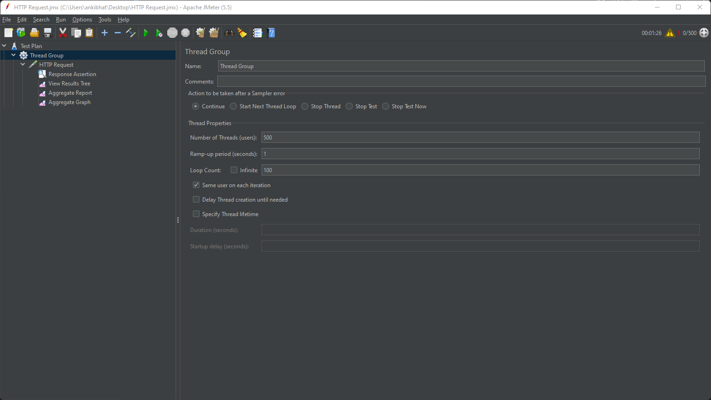
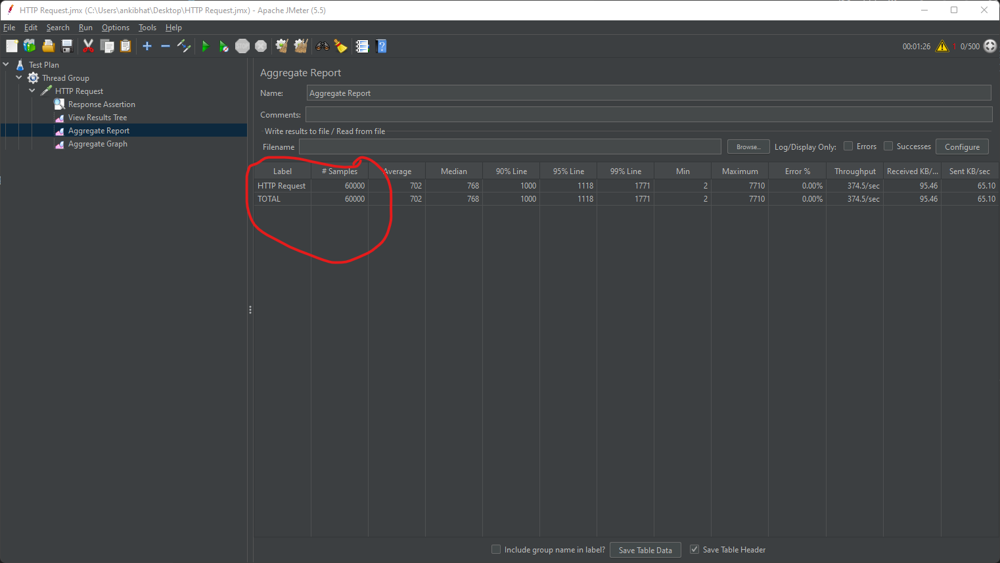

### Body parser

#### Description: 
#### This is simple express.js application, which has one endpoint and body parser is implemented here without using any prebuild express library or external dependency.

#### expressJsonParser.js is an implementation of express middleware function that read and parse json data from request body.

#### I have implemented integration test inside test folder.

### How to test the application
```
 npm install
 npm test
```
### How to run the application
```
 node app.js
```
### Application performance tested with jmeter
#### 500 users making parallel request per second 100 times. 

